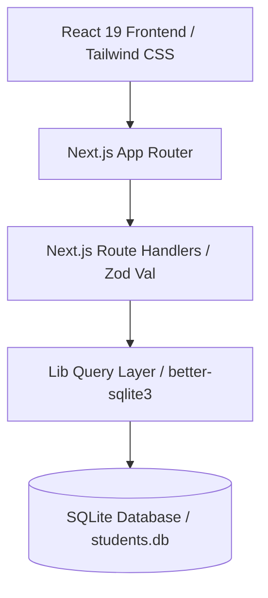

# EduSuite

> The modern, high-performance administrative core for academic operations.

**Live Demo:** [student-management.jainoos.xyz](https://student-management.jainoos.xyz/)

EduSuite is a production-ready academic registry and curriculum management portal. It serves as a unified command center for university registrars, advisors, and administrators to orchestrate student directories, manage academic course catalogs, handle student enrollments, and track system operations with a real-time audit trail.


---

## Table of Contents

1. [Overview](#overview)
2. [Features](#features)
3. [Tech Stack](#tech-stack)
4. [Architecture](#architecture)
5. [Folder Structure](#folder-structure)
6. [Getting Started](#getting-started)
7. [Environment Variables](#environment-variables)
8. [API Endpoints](#api-endpoints)
9. [Database Schema](#database-schema)

---

## Overview

Educational institutions often suffer from fragmented student databases, complex course requirements, and manual registry audits. EduSuite solves these operational inefficiencies by consolidating data into an intuitive, responsive administrative portal.

### The Problem

- **Siloed Data:** Registry records are isolated from course schedules and curriculum databases.
- **Complex Audits:** Manual tracking makes it difficult to audit changes to enrollment records, course credits, or student registrations.
- **Outdated UI/UX:** Traditional academic software is clunky, slow, and not mobile-friendly.

### The Solution

EduSuite provides a modern administrative interface that acts as the single source of truth. It validates enrollment limits, manages credit hours, and maintains a strict, live-updating system audit trail.

- **Target Users:** Registrars, Academic Advisors, Department Chairs, and University IT Administrators.

---

## Features

### 🎓 Student Registry (CRUD)

- **Complete Lifecycle Management:** Register, update, search, and delete student records via responsive, animated modal dialogs.
- **Zod-Validated Inputs:** Strict schema enforcement on age limits (minimum 16 years), email validation, and department selections.

### 📚 Course Catalog Management

- **Curriculum Control:** Register and edit courses with unique codes (e.g., `CS101`, `MATH201`) and credit weights (1-10 credits).
- **Credit Validation:** Prevents invalid inputs and checks code conflicts via database constraint checks.

### 🔄 Enrollment & Transcript Engine

- **Interactive Course Mappings:** Dynamically enroll or unenroll students in courses.
- **Transcript Print Engine:** Generate and print formatted academic transcripts containing enrolled courses, credit weights, and registry metadata.

### ⚡ Live System Audit Trail

- **Automated Logging:** Track all `CREATE`, `UPDATE`, `DELETE`, and `ENROLL` actions automatically.
- **Auto-Refreshing Feed:** System actions log instantly to a background feed that polls/auto-refreshes every 15 seconds.

### 🔍 Advanced Search & Filtering

- **Dynamic Search:** Debounced instant query filtering across student profiles (names, emails, departments) and course catalogs.
- **Multi-Dimensional Dropdowns:** Combine search queries with active department and course filter chips.

### 🎨 Premium UI/UX

- **Responsive Layout:** Adaptive desktop side-drawer navigation and mobile accordion nav with smooth Framer Motion transitions.
- **Dark Mode Support:** Smooth state transitions with persistent theme synchronization (using local storage and media queries).

---


## Tech Stack

| Category            | Technology                                                                       |
| ------------------- | -------------------------------------------------------------------------------- |
| **Frontend**        | React 19, Next.js 16 (App Router), Lucide React, Framer Motion, `@base-ui/react` |
| **Backend**         | Next.js API Route Handlers (Node.js runtime)                                     |
| **Database**        | SQLite & Drizzle ORM, powered by the high-performance `better-sqlite3` driver     |
| **Styling**         | Tailwind CSS v4, Vanilla CSS variables                                           |
| **State & Dialogs** | React State, Sonner (Toast system), Radix-based Shadcn Dialog components         |
| **Validation**      | Zod (for runtime API payload validation)                                         |
| **Development**     | TSX (TypeScript execute runner), TypeScript, ESLint                              |

---

## Architecture

EduSuite uses a decoupled Next.js architecture mapping client-side components to file-based API route handlers backed by an SQLite data store.



- **Server Components:** Utilized for rendering static scaffolding and layout structures (e.g., [layout.tsx](<app/(app)/layout.tsx>) and page wrappers).
- **Client Components (`"use client"`):** Power the interactive features like filter bars, dynamic tables, Sonner toast notifications, and modal forms.
- **Database Layer:** Directly queries SQLite file-system databases, removing the network latency associated with external cloud databases.

---

## Folder Structure

```text
├── app/
│   ├── (app)/               # Protected app pages
│   │   ├── courses/         # Course directory table & creation forms
│   │   ├── dashboard/       # Aggregated stats & live audit logs
│   │   ├── students/        # Student directory with course enrollment modals
│   │   └── layout.tsx       # Standard sidebar/navigation scaffolding
│   ├── api/                 # Endpoint routes
│   │   ├── audit/           # Fetch system audit logs
│   │   ├── course/          # Course catalog CRUD endpoints
│   │   ├── dashboard/       # Aggregate analytics endpoint
│   │   ├── departments/     # Get all registered department names
│   │   ├── enrollment/      # Manage student-to-course enrollments
│   │   └── students/        # Student registry CRUD endpoints
│   ├── globals.css          # Tailwind directives & CSS variable mappings
│   ├── layout.tsx           # Global HTML wrapper (Theme script, Toasts)
│   └── page.tsx             # Interactive landing page
├── components/
│   ├── ui/                  # Reusable UI primitives (Buttons, Dialogs, Selects)
│   ├── DashboardAuditFeed.tsx # Live-updating audit trail logger component
│   └── ThemeToggle.tsx      # Dark/Light mode selector
├── database/
│   └── students.db          # SQLite persistent database file
├── lib/                     # Application helper libraries & utilities
│   ├── db/                  # Drizzle database layer
│   │   ├── queries/         # Database query wrappers using Drizzle ORM
│   │   │   ├── audit.ts     # Audit log queries
│   │   │   ├── course.ts    # Course registry queries
│   │   │   ├── enrollment.ts # Enrollment queries
│   │   │   └── student.ts   # Student registry queries
│   │   ├── schema/          # Drizzle ORM schema definitions
│   │   │   ├── course.ts    # Courses table definition (with soft delete)
│   │   │   ├── enrollment.ts # Enrollments table definition (with soft delete, grades)
│   │   │   ├── index.ts     # Schema exporter
│   │   │   └── student.ts   # Students & Audit Logs table definitions
│   │   ├── index.ts         # SQLite & Drizzle initialization
│   │   └── utils.ts         # DB-specific utility files
│   ├── schemas.ts           # Zod validation schemas
│   └── utils.ts             # Common UI/utility helpers
├── scripts/
│   ├── init-db.ts           # Database initialization (DDL via drizzle-kit push)
│   └── seed.ts              # Database seeding script (mock records)
├── types/                   # Unified TypeScript definitions
├── package.json
└── tsconfig.json
```

---

## Getting Started

### Prerequisites

- Node.js (v18.x or higher)
- npm, yarn, pnpm, or bun

### Setup Instructions

1. **Clone the Repository**

   ```bash
   git clone https://github.com/[YOUR_USERNAME]/student-management.git
   cd student-management
   ```

2. **Install Dependencies**

   ```bash
   npm install
   ```

3. **Initialize and Seed the Database**
   Initialize the SQLite tables and seed them with 50 mock students and 8 default courses:

   ```bash
   # Create database tables
   npx tsx scripts/init-db.ts

   # Seed database with dummy records
   npm run db:seed
   ```

4. **Run the Development Server**

   ```bash
   npm run dev
   ```

   Open [http://localhost:3000](http://localhost:3000) in your browser to view the application.

5. **Build and Run for Production**

   ```bash
   # Build the Next.js bundle
   npm run build

   # Start the production server
   npm run start
   ```

---

## Environment Variables

EduSuite runs out-of-the-box using local SQLite configurations. No external database credentials are required. If you choose to configure custom ports or external logging features, you can add them to a `.env` file:

| Variable   | Description                     | Default       | Required |
| ---------- | ------------------------------- | ------------- | -------- |
| `PORT`     | Local server port configuration | `3000`        | No       |
| `NODE_ENV` | Application environment state   | `development` | No       |

---

## API Endpoints

### Student Endpoints (`/api/students`)

| Method   | Endpoint                     | Description                                                                                |
| -------- | ---------------------------- | ------------------------------------------------------------------------------------------ |
| `GET`    | `/api/students`              | Fetch students with query parameters (`query`, `courseId`, `department`, `page`, `limit`). |
| `POST`   | `/api/students`              | Register a new student. Validates payload structure using Zod.                             |
| `PUT`    | `/api/students/[id]`         | Update student details (name, email, age, department).                                     |
| `DELETE` | `/api/students/[id]`         | Delete a student and all associated course enrollment records.                             |
| `GET`    | `/api/students/[id]/courses` | Fetch all courses that a specific student is enrolled in.                                  |

### Course Endpoints (`/api/course`)

| Method   | Endpoint           | Description                                                       |
| -------- | ------------------ | ----------------------------------------------------------------- |
| `GET`    | `/api/course`      | Retrieve catalog courses with filters (`query`, `page`, `limit`). |
| `POST`   | `/api/course`      | Add a new course. Code must be unique.                            |
| `PUT`    | `/api/course/[id]` | Update course parameters (name, code, credits).                   |
| `DELETE` | `/api/course/[id]` | Delete a course from the catalog database.                        |

### Enrollment & Helper Endpoints

| Method   | Endpoint               | Description                                                       |
| -------- | ---------------------- | ----------------------------------------------------------------- |
| `POST`   | `/api/enrollment`      | Enroll a student in a course (body: `{ student_id, course_id }`). |
| `DELETE` | `/api/enrollment/[id]` | Unenroll a student from a course by enrollment ID.                |
| `GET`    | `/api/departments`     | Fetch unique lists of departments for filter dropdowns.           |
| `GET`    | `/api/audit`           | Fetch the latest 20 audit logs.                                   |
| `GET`    | `/api/dashboard`       | Fetch aggregate data cards and popular course arrays.             |

---

## Database Schema (Drizzle ORM)

EduSuite uses Drizzle ORM to define and query the SQLite database. Below are the schema definitions mapping TypeScript schemas to SQLite tables.

### 🧑‍🎓 Students Table (`lib/db/schema/student.ts`)
```typescript
import { sqliteTable, integer, text } from 'drizzle-orm/sqlite-core';

export const students = sqliteTable('students', {
  id: integer('id').primaryKey({ autoIncrement: true }),
  name: text('name').notNull(),
  email: text('email').unique().notNull(),
  age: integer('age').notNull(),
  department: text('department').notNull(),
  created_at: text('created_at').notNull(),
  deleted_at: text('deleted_at'), // Soft delete
});
```

### 📚 Courses Table (`lib/db/schema/course.ts`)
```typescript
import { sqliteTable, integer, text } from 'drizzle-orm/sqlite-core';

export const courses = sqliteTable('courses', {
  id: integer('id').primaryKey({ autoIncrement: true }),
  name: text('name').notNull(),
  code: text('code').unique().notNull(),
  credits: integer('credits').notNull(),
  created_at: text('created_at').notNull(),
  deleted_at: text('deleted_at'), // Soft delete
});
```

### 🔄 Enrollments Join Table (`lib/db/schema/enrollment.ts`)
```typescript
import { sqliteTable, integer, text, unique } from 'drizzle-orm/sqlite-core';
import { students } from './student';
import { courses } from './course';

export const enrollments = sqliteTable('enrollments', {
  id: integer('id').primaryKey({ autoIncrement: true }),
  student_id: integer('student_id').notNull().references(() => students.id, { onDelete: 'cascade' }),
  course_id: integer('course_id').notNull().references(() => courses.id, { onDelete: 'cascade' }),
  enrollment_date: text('enrollment_date').notNull(),
  deleted_at: text('deleted_at'), // Soft delete
  grade: text('grade'),
}, (t) => [
  unique().on(t.student_id, t.course_id)
]);
```

### ⚡ System Audit Log Table (`lib/db/schema/student.ts`)
```typescript
export const auditLogs = sqliteTable('audit_logs', {
  id: integer('id').primaryKey({ autoIncrement: true }),
  action: text('action').notNull(), // CREATE, UPDATE, DELETE, ENROLL, UNENROLL
  entity_type: text('entity_type').notNull(), // student, course, enrollment
  entity_id: integer('entity_id'),
  details: text('details').notNull(),
  created_at: text('created_at').notNull(),
});
```

---

## Database Migration & Management

We use Drizzle Kit to manage SQLite migrations and schema modifications:

- **Generate Migrations:** `npm run db:generate`
- **Apply Migrations:** `npm run db:migrate`
- **Push Schema changes directly (Development):** `npm run db:push` or `npx tsx scripts/init-db.ts`
- **Open Drizzle Studio UI:** `npm run db:studio`
- **Re-create Database (Fresh):** `npm run db:fresh`
- **Seed Mock Data:** `npm run db:seed`
